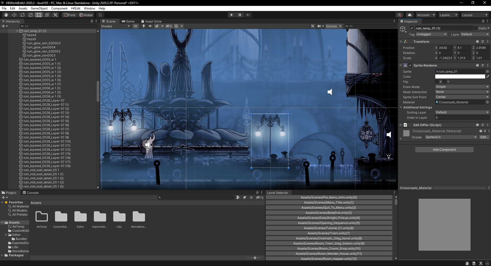

# HKEdit2

HKEdit2 is a Hollow Knight level editor. It is currently a work in progress.

HKEdit works by moving the contents of a level file into a unity scene file with extra metadata. Whenever the scene is updated and converted, it becomes a diff file which can be redistributed without including any content from the game.

Simply download the project (downloading the code is fine, there are no releases) and open the folder in the Unity 2020.2.2f1 editor. You can load a scene with `HKEdit->Load Scene By File` by file or `HKEdit->Open Scene By Name` by name. You can save a scene by `HKEdit->Save Scene` with the scene you want to save open (not finished yet! this does nothing right now).

Progress:

* [x] Read Scenes
* [x] Writable Scenes
* [x] TK2D
* [ ] Diff Generation
* [ ] Fix mod to be compatible

If you have any crashes/errors, please create an issue (unless you're doing something stupid like building the project). I know about the animation warning, it shouldn't create any issues for now. If a scene becomes corrupted after editing and saving, close the editor, delete the .unity and .meta for the scene in Assets/ExportedScenes and delete the .assets and .metadata files in ExportedScenesData to clear the scene cache.